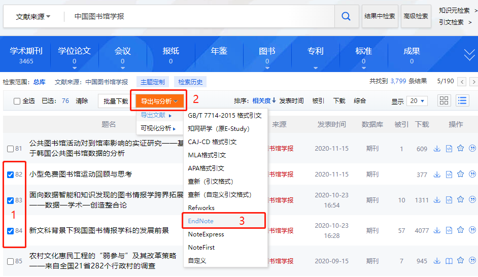

# 如何高效地将CNKI论文元数据与全文导入Endnote?

## 获取论文元数据
CNKI官方网站提供，不同格式类型的论文元数据下载。只需在CNKI系统中，搜索、选取你选择的论文，然后按导出:


之后你就能够获取到一个如下格式的txt文件：
Endnote Journal Article 元数据格式如下：
```text
%0 Journal Article
%A 尹召凯
%A 任同
%A 张志强
%+ 南京大学信息管理学院;南京大学出版研究院;
%T 中国居民阅读行为对社会治理绩效感知的影响研究——基于CGSS2015数据的实证分析444444444444
%J 中国图书馆学报
%K 全民阅读;阅读行为;社会治理;阅读推广
%X 在国家治理体系与治理能力现代化的语境下，出版与阅读发挥着提升公民综合素质的重要作用。为探究阅读行为如何影响个体对社会治理的绩效感知，本文基于CGSS2015的数据，实证分析个体阅读行为与社会治理绩效感知之间的内在关联。结果发现：阅读行为对整体的社会治理绩效感知具有促进作用，但存在一定的阈值效应；从受教育程度来看，阅读行为对中等教育水平居民的社会治理绩效感知有正向影响，对低教育水平和高教育水平居民影响不显著，呈现“倒U型”关系；从收入水平来看，阅读行为对中等偏下收入阶层居民的社会治理绩效感知影响效果最强；从居住地的城乡差异来看，阅读行为对城镇居民和农村居民的社会治理绩效感知均呈正向影响，对城镇居民的影响效果更强。建议：从社会治理提升角度重新审视出版功能，重视以出版物阅读为文化途径参与国家治理体系和治理能力现代化，进一步肯定阅读推广的必要性，深入落实全民阅读推广政策；在阅读推广实践上，应注重受众群体从精英阶层到普通民众的转向；面对出版与阅读向数字转型的时代趋势，需慎重看待新兴网络与传统媒介的关系，审慎把关阅读内容，努力营造良好的网络阅读环境，更好发挥阅读在社会治理中的积极作用。表8。参考文献51。
%P 1-21
%@ 1001-8867
%L 11-2746/G2
%U https://kns.cnki.net/kcms/detail/11.2746.g2.20220316.1949.004.html
%W CNKI
```
正常情况下，我们使用Endnote的import功能就可以非常简单地将文件里面的元数据导入到Endnote，然后通过手工添加附件完成论文全文的导入。
非常遗憾，这是非常低效率的做法，但目前Endnote也没有提供更高效率的工具来完成以上工作。

## 高效导入论文全文
### 预备知识
通过网络检索，我们发现Endnote提供了以下语法，可以在元数据中附加文件，然后一次性导入元数据及论文全文：
```text
%> C:\Folder\File.pdf
```
例如：
```text
%0 Journal Article
%A 尹召凯
%A 任同
%A 张志强
%+ 南京大学信息管理学院;南京大学出版研究院;
%T 中国居民阅读行为对社会治理绩效感知的影响研究——基于CGSS2015数据的实证分析444444444444
%J 中国图书馆学报
%K 全民阅读;阅读行为;社会治理;阅读推广
%X 在国家治理体系与治理能力现代化的语境下，出版与阅读发挥着提升公民综合素质的重要作用。为探究阅读行为如何影响个体对社会治理的绩效感知，本文基于CGSS2015的数据，实证分析个体阅读行为与社会治理绩效感知之间的内在关联。结果发现：阅读行为对整体的社会治理绩效感知具有促进作用，但存在一定的阈值效应；从受教育程度来看，阅读行为对中等教育水平居民的社会治理绩效感知有正向影响，对低教育水平和高教育水平居民影响不显著，呈现“倒U型”关系；从收入水平来看，阅读行为对中等偏下收入阶层居民的社会治理绩效感知影响效果最强；从居住地的城乡差异来看，阅读行为对城镇居民和农村居民的社会治理绩效感知均呈正向影响，对城镇居民的影响效果更强。建议：从社会治理提升角度重新审视出版功能，重视以出版物阅读为文化途径参与国家治理体系和治理能力现代化，进一步肯定阅读推广的必要性，深入落实全民阅读推广政策；在阅读推广实践上，应注重受众群体从精英阶层到普通民众的转向；面对出版与阅读向数字转型的时代趋势，需慎重看待新兴网络与传统媒介的关系，审慎把关阅读内容，努力营造良好的网络阅读环境，更好发挥阅读在社会治理中的积极作用。表8。参考文献51。
%P 1-21
%@ 1001-8867
%L 11-2746/G2
%U https://kns.cnki.net/kcms/detail/11.2746.g2.20220316.1949.004.html
%W CNKI
%> C:\Folder\File.pdf
```
题外话：上述方法的灵感来源于ACS、Wiley、RSC、Elsevier等出版商常用的RIS协议中的L1-file:语句，在.ris文件中这一语句可以写作：
> L1 - file://C:\Folder\File.pdf

### 方案思路
基于以上知识，我们整理下解决方案的思路：  
1. CNKI导出Endnote元数据，同时导出知网研学（原e-study）元数据，一数据两格式。
2. 将.es6元数据文件导入知网研学（原e-study）软件，并且一键下载全文。之后，我们本地就获取到了以title命名的论文全文。
3. 使用python脚本将本地pdf文件，路径附加到endnote元数据。
4. 使用Endnote import 功能，将含有全文地址的元数据文件导入。

### 实现代码
```python
# coding=utf-8
'''
功能：在endnote元数据文件附上全文地址
'''
import os

# 获取e-study论文文件路径、名称
def get_all_files(pdf_dir):
    files=[]
    files_dic={} # 文件名：文件路径;可能有重名文件，路径会被后面的覆盖
    for dir in os.listdir(pdf_dir):
        path=pdf_dir+'/'+dir
        if os.path.exists(path):
            for file_name in os.listdir(path):
                file_and_path =path+'/'+file_name
                file_name_without_ext=os.path.splitext(file_name)[0]
                files_dic[file_name_without_ext]=file_and_path
    return files_dic

def endnote_dc_formatter(source_file,save_file,pdf_dir):
    pdf_files=get_all_files(pdf_dir) # 返回 dic ,文件名：文件路径; 使用文件名可以取得路径。
    #print(pdf_files)
    lines=[]
    lines_new = []
    with open(source_file,'r',encoding='utf-8') as f:
        for line in f.readlines():
            #print(line.index())
            lines.append(str(line))
    for line in lines:
        if line.startswith('%T '):
            title=line[3:]
            t = title[0:-1]
            print(t)
            if pdf_files.get(t):# 避免pdf_files[key],key不存在触发错误
                pdf_file_path=pdf_files[t]
                line=line+ '%> '+ pdf_file_path +'\n'
        lines_new.append(line)
    f=''.join(lines_new)
    with open(save_file,'w',encoding='utf-8') as new_file:
        new_file.write(f)

if __name__=='__main__':
    source_file='H:/Users/pengyan/Downloads/CNKI-20.txt'
    save_file='H:/Users/pengyan/Downloads/CNKI-20_new.txt'
    pdf_dir='G:/private src data/e-study/pengyansrc/Literature'
    endnote_dc_formatter(source_file,save_file,pdf_dir)
```


## 参考
* [endnote怎样才能高效将PDF论文添加到已导入的文献信息?](https://www.zhihu.com/question/389538134)
* [代码下载](endnote_dc_fulltext.py)