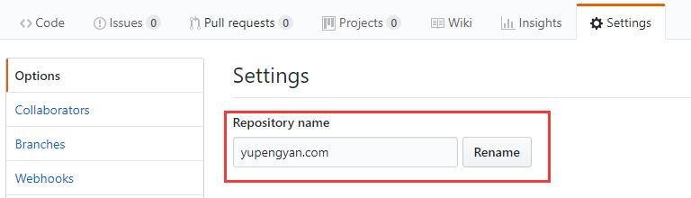
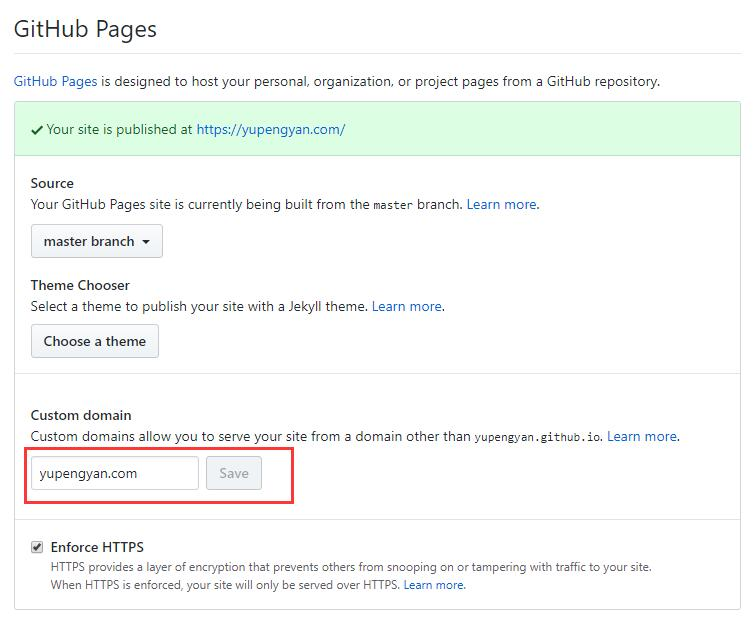
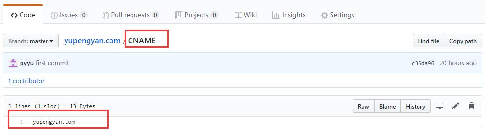

----
blogpost: true
Title: github pages
date: March 2, 2022
category: Tech
Tags: github pages
----


# Github pages 

## Set up a Custom domain    
1. DNS: Add an A record point to github server.    

```text
185.199.108.153
185.199.109.153
185.199.110.153
185.199.111.153
```


2. Go to your repo setting.      
    1. Rename your repositry name to :example.com   

    2. Setting -> Github pages -> Custom domain -> example.com    

  
3. Add a CNAME file in your repositry.    
```text
examle.com
```



That's it!


## FAQ:
Q: CNAME already taken, what should I do?

A: Ask github for help! They are very nice.Go to see more [detail](https://help.github.com/en/articles/troubleshooting-custom-domains#cname-already-taken).

