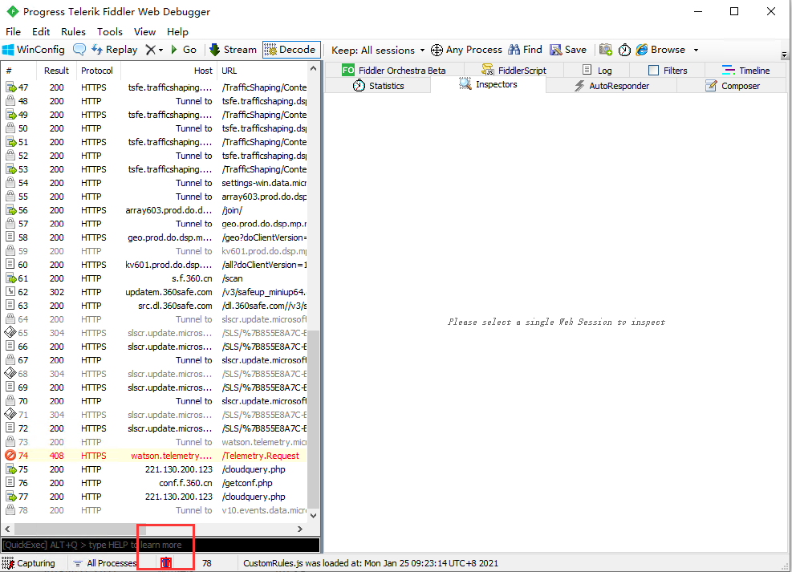
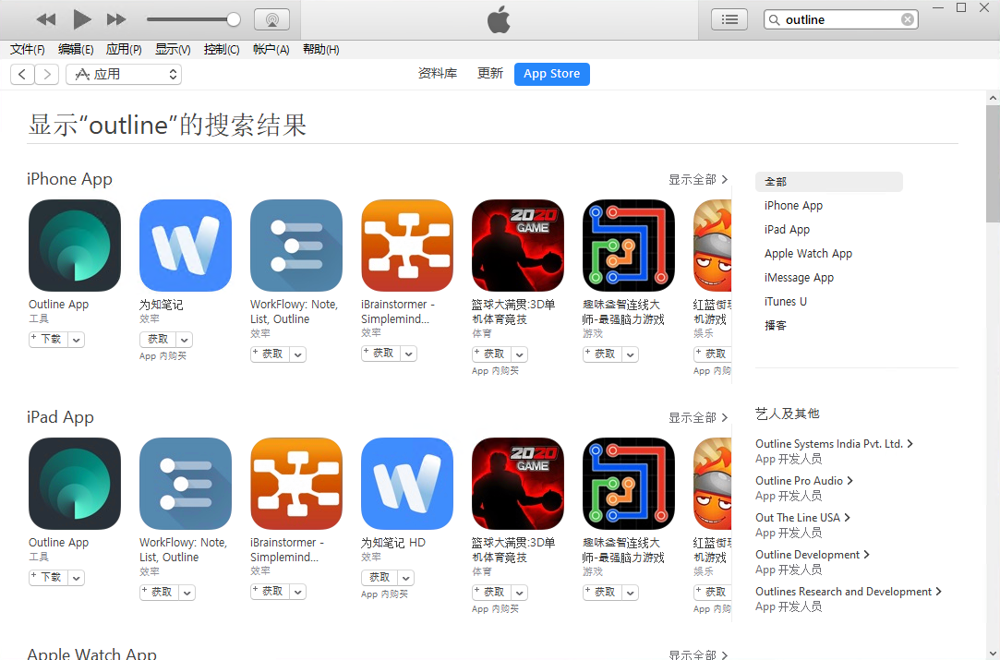
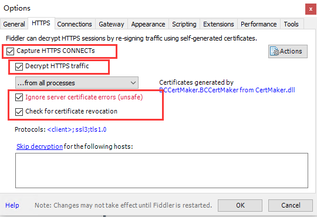
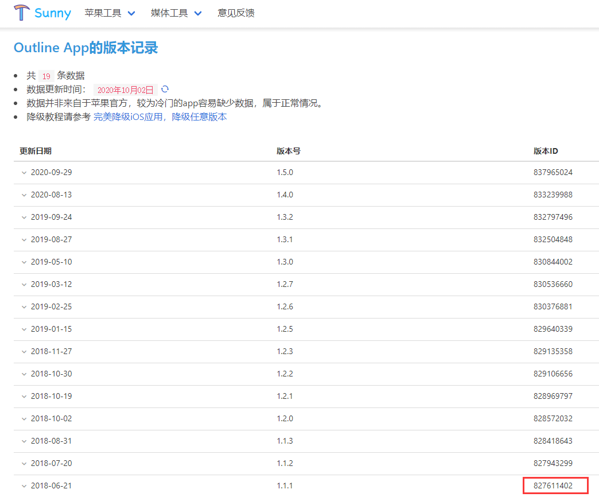
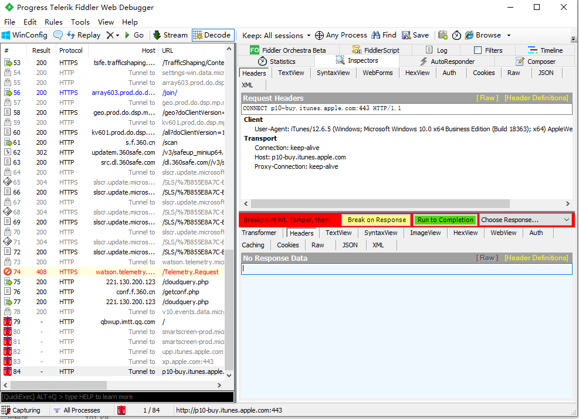
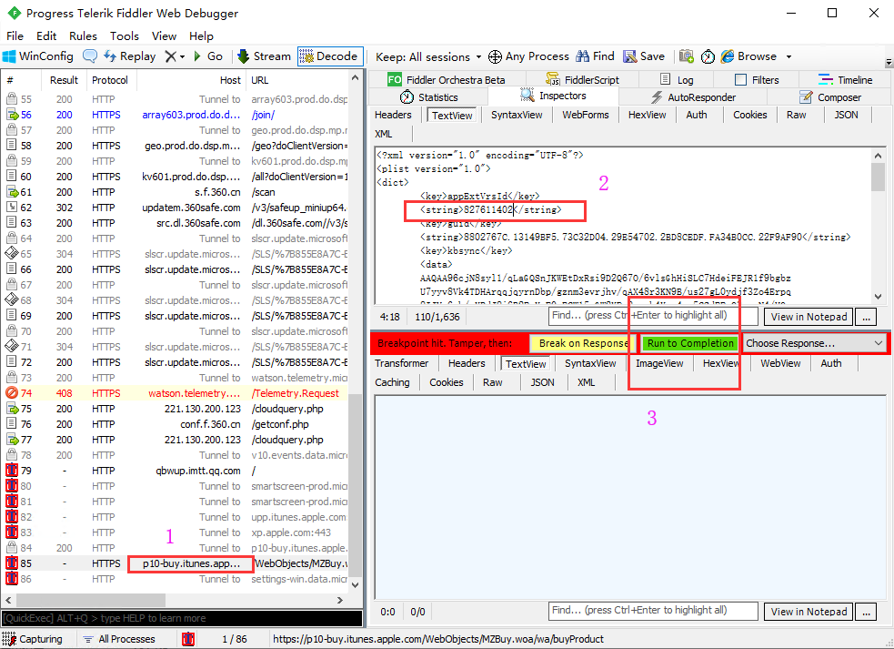
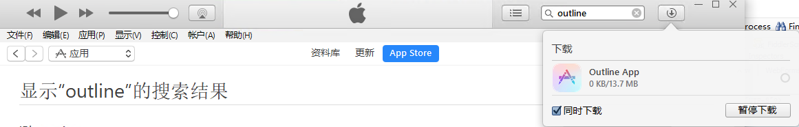

#IOS App 安全降级
此教材是利用官方app store进行降级下载，最具安全性。  

## 准备工作
1. Fiddle，用于抓包、置换。
2. iTunes 12.6.5 ，最后一个具有app store的iTunes.

## 步骤
1. 打开iTunes，在app store里面搜索到目标app。如：outline。

2. 打开Fiddle，并设置：菜单 Tools -> Options -> HTTPS , 选择上Capture HTTPS CONNECTs...按OK，Fiddle的证书会安装到系统。  

   
3. [查找](https://tools.lancely.tech/apple/app-search) 好需要降级App的版本ID，并复制。如：Outline 1.1.1版本ID：827611402

   
4. 准备拦截。进入Fiddler工具，点击快捷键「F11」，左下角会出现一个红色的「T」，Fiddler便开始进行拦截。

   
5. 在iTurnes点击下载软件，回到Fiddler界面，找到类似p10-buy开头的URL双击，然后右边绿色按钮Run to Completion.

6. Fiddler界面,等待p100buy...这条请求的完成，双击；在右边，TextView找到如图2的位置，修改成之前准备的ID，然后点击如图3的绿色按钮Run to Completion.   

   
7. 在iTurnes看到app已经在下载，就可以关闭Fiddler了。下载完成后，在资料库可以找到下载的app。

##FAQ
1. Fiddle不能成功抓包，检查：
前提条件（Windows系统）：
1、已设置Fiddler的代理端口
　　Tools –> Options-> Connections，设置代理端口：8888， 勾选 Allow remote computers to connect，即允许远程计算机连接Fiddler，

注：8888为默认端口号，可修改，但需注意两点，一是本机空闲端口，二是手机代理设置时要与fiddler的端口一致。

2、已设置解密HTTPS的网络数据
　　Tools –> Options-> Https，勾选"Decrypt HTTPS traffic"、"Ignore server certificate errors。
　解决方案：
　经一番波折后发现，是因为未安装证书。
　在Tools –> Options-> Https中点击Actions->Trust Root Certificate，进行安装证书，重启fiddler，然后再抓包就可以看到内容 了。
　（如果是要使用浏览器，记得在浏览器中设置代理，这里就不多说了）

代理的问题....office pc 搞不定，在戴尔上面OK！

2. 6.57版本

推荐微信6.57（821589898）版本。这个版本的微信该有的基本功能都有了，但是内存和运存比较低。相比牺牲功能来换取内存，这个版本是最合适的。

##参考：
1. [iOS App 任意版本降级教程（新手向）](https://zhuanlan.zhihu.com/p/136952051) 
2. [硬核！完美降级iOS应用，降级任意版本](https://zhuanlan.zhihu.com/p/101541667)
3. [App历史版本查询](https://tools.lancely.tech/apple/app-search)