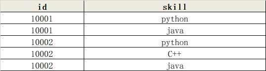
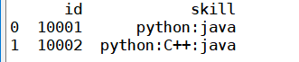

# pandas利用groupby分组对字符串字段进行合并拼接

## 案例  
数据：


需要的效果：


code:
```python
import pandas as pd
df=pd.read_excel('data.xlsx')
df=df.groupby('id')['skill'].apply(lambda x: x.str.cat(sep=':')).reset_index()
print(df)
```
多列：   
```python
df= df.groupby(['Tweet date','Username'])['Saved filename'].apply(lambda x: x.str.cat(sep=';')).reset_index()
```

## 参考
https://blog.csdn.net/d1240673769/article/details/106038811  