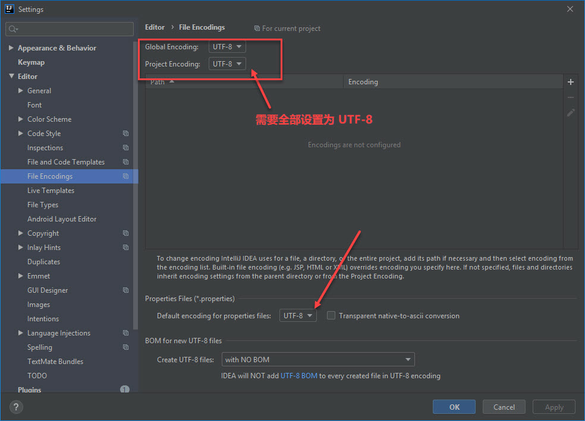

# How to make rst file encoding correct in pycharm

## Steps
1. File -> Settings -> Editor -> Code Style -> File Encodings
2. Make Settings just like the pic below:  

3. Help -> Edit Coustom VM Options, add the following option:
    ```text
    -Dfile.encoding=UTF-8
    ```
   eStructuredText use JAVA, so you have to add a VM option.
4. restart IDE.  


