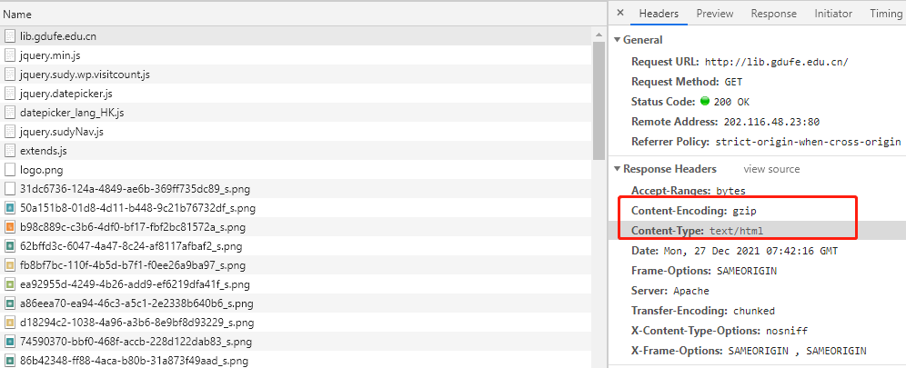

# Haproxy 如何优化网站速度？


## 服务器压缩

```text
listen  web_host
  bind 10.0.0.7:80
  mode http
  balance  roundrobin
  log global
  option httplog
  compression algo gzip deflate
  compression type compression type text/plain text/html text/css text/xml text/javascript application/javascript
  server web1 10.0.0.17:80  cookie web1 check inter 3000 fall 3 rise 5
  server web2 10.0.0.27:80  cookie web2 check inter 3000 fall 3 rise 5

#后端服务器准备一个文本文件
[root@centos7 ~]#ll /var/www/html/m.txt  -h
-rwxr-xr-x 1 root root 772K Apr  2 12:56 /var/www/html/m.txt

#验证
[root@centos6 ~]#curl  -is --compressed   10.0.0.7/m.txt|less
HTTP/1.1 200 OK
date: Thu, 02 Apr 2020 05:00:26 GMT
server: Apache/2.4.6 (CentOS) PHP/5.4.16
last-modified: Thu, 02 Apr 2020 04:56:25 GMT
etag: W/"c0ef6-5a2479f7aee68"
accept-ranges: bytes
content-type: text/plain; charset=UTF-8
set-cookie: WEBSRV=web1; path=/
cache-control: private
content-encoding: deflate
transfer-encoding: chunked
vary: Accept-Encoding

Feb  2 18:49:27 centos7 journal: Runtime journal is using 6.0M (max allowed 48.6M, trying to leave 72.9M free of 480.1M available → current limit 48.6M).
Feb  2 18:49:27 centos7 kernel: Initializing cgroup subsys cpuset
Feb  2 18:49:27 centos7 kernel: Initializing cgroup subsys cpu
Feb  2 18:49:27 centos7 kernel: Initializing cgroup subsys cpuacct
......
```




## 参考文献
1. http://www.yunweipai.com/35293.html
2. https://www.haproxy.com/blog/haproxy-and-gzip-compression/